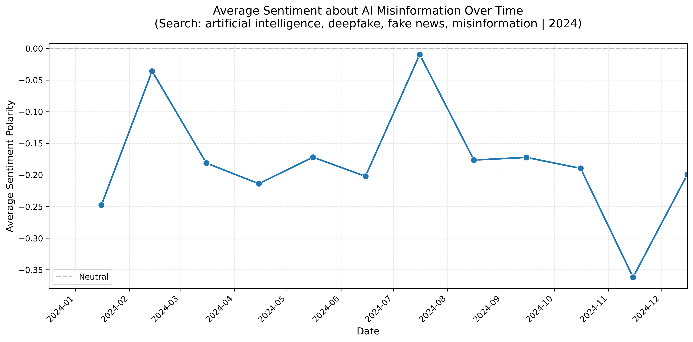

# AI Fake News Sentiment Tracker

UIUC CS410 Final Project — Fall 2025  
AI Fake News Sentiment Tracking and Trend Analysis  
A Python-based system for news retrieval, sentiment analysis (TextBlob & RoBERTa), and temporal trend visualization.


**Project Code + Documentation Submission Link**: https://github.com/dongyeon522/ai-fake-news-sentiment

**Project Presentation Submission Link**: https://mediaspace.illinois.edu/media/t/1_e137pu64 or [here](https://github.com/dongyeon522/ai-fake-news-sentiment/blob/main/CS410_Project_Presentation_dk72.mp4)

**Final Report Link**: https://github.com/dongyeon522/ai-fake-news-sentiment/blob/main/final_report.docx

**TextData Link**: https://textdata.org/submissions/68eb8d21d79b5a018fcc4039 

---

## Author

DongYeon Kim (dk72@illinois.edu) 

Course: CS410 – Text Information Systems  
Instructor: Prof. ChengXiang Zhai  
Institution: University of Illinois Urbana-Champaign  

---

## Project Overview

This project implements a lightweight information retrieval and sentiment analysis pipeline to track how news media describe AI-generated fake news, deepfakes, and misinformation.  
The system collects news articles from the New York Times API, builds a unified text corpus, and applies two sentiment models:

- **TextBlob** – lexicon-based polarity scores  
- **RoBERTa** – transformer-based sentiment classifier  

By aggregating monthly sentiment trends over 2024, the project approximates how public perception of AI-related misinformation is reflected in media tone. It also provides utilities for TF-IDF and BM25 ranking to support future retrieval evaluation experiments.

---

## Features

- NYT Article Search API integration for AI-related queries  
- Month-by-month crawling for the full year of 2024  
- Unified text corpus (title + description + content) per article  
- Dual sentiment analysis:
  - TextBlob polarity scores
  - RoBERTa-based sentiment scores
- Monthly sentiment trend plots for each model  
- CSV exports for both raw and processed corpora  
- TF-IDF and BM25 ranking utilities for future IR evaluation  
- Fully CPU-compatible; no GPU required for the current pipeline

---

## Repository Structure

```text
ai-fake-news-sentiment/
├── data/
│   ├── raw/                  # Raw NYT API CSV files
│   ├── processed/            # Corpus + sentiment CSV files
│   └── figures/              # Sentiment trend plots (PNG)
│
├── collector.py              # NYT article retrieval
├── preprocess.py             # Text cleaning and corpus construction
├── sentiment.py              # TextBlob / RoBERTa sentiment models
├── ranking.py                # TF-IDF / BM25 ranking utilities
├── evaluate.py               # Sentiment distribution statistics
├── visualize.py              # Time-series plotting of sentiment trends
├── main.py                   # End-to-end pipeline runner
├── requirements.txt          # Python dependencies
└── README.md                 # Project documentation

---

## Installation

1. Clone the repository
```bash
git clone https://github.com/dongyeon522/ai-fake-news-sentiment
cd ai-fake-news-sentiment
```

2. Create and activate a virtual environment
```bash
python3 -m venv venv
source venv/bin/activate
```

3. Install dependencies
```bash
pip install -r requirements.txt
```
---

## Configuration

###Set up NYT API key

1. Copy the example environment file:
```bash
cp .env.example .env
```
2. Open .env and set your key:
```bash
NYT_API_KEY=YOUR_NYT_API_KEY_HERE
```
---
## Data Collection & Processing

The main pipeline script performs:
1. Article collection from the NYT API
2. Text preprocessing and corpus construction
3. Sentiment analysis (TextBlob or RoBERTa)
4. Monthly aggregation and visualization

### Run the full pipeline
```bash
python main.py
```
You will be prompted to:
- choose the sentiment model (TextBlob or RoBERTa), and
- confirm the collection / analysis run for 2024.

### Output files

After running the pipeline, you should see files like:
- `data/raw/articles_YYYYMMDD_XXX.csv`
  - Raw NYT API responses (one row per article)
- `data/processed/corpus_with_sentiment_YYYYMMDD_XXX.csv`
  - Unified text field and sentiment score for each article
- `data/figures/sentiment_over_time_20251205_002.png`
  - TextBlob monthly sentiment trend (example)
- `data/figures/sentiment_over_time_20251205_004.png`
  - RoBERTa monthly sentiment trend (example)

### Implementation Details
`collector.py` – Article Retrieval
- Interfaces with the NYT Article Search API
- Uses four queries to capture AI-related misinformation topics:
  - “artificial intelligence”
  - “deepfake”
  - “fake news”
  - “misinformation”
- Runs month-by-month retrieval for all of 2024
- Respects API limits and retries on temporary failures
- Saves collected articles as CSV in data/raw/

`preprocess.py` – Text Cleaning & Corpus Construction
- Concatenates title, description, and content into a single text field
- Fills missing values with empty strings
- Normalizes basic whitespace
- Produces a cleaned corpus ready for sentiment analysis

`sentiment.py` – Sentiment Modeling
- TextBlob mode
  - Computes polarity scores in the range [–1, +1]
  - Uses ±0.1 as a heuristic threshold for positive / negative classification
- RoBERTa mode
  - Applies a pretrained transformer-based sentiment classifier
  - Outputs scores that better capture nuanced concern or risk framing
Both modes append a sentiment column to the processed corpus.

`ranking.py` – TF-IDF & BM25 Utilities
- Builds TF-IDF and BM25 representations of the corpus
- Provides helper functions for ranking documents by relevance
- Intended for future experiments with retrieval quality (Precision@k, nDCG, etc.)

`evaluate.py` – Sentiment Statistics
- Aggregates sentiment into positive, neutral, and negative proportions
- Supports threshold-based analysis of model outputs
- Useful for comparing TextBlob and RoBERTa behavior

`visualize.py` – Sentiment Trend Plotting
- Aggregates sentiment scores by month
- Generates time-series plots for each model
- Saves PNG figures under data/figures/

`main.py` – Orchestration
- Coordinates the full pipeline:
  - retrieval → preprocessing → sentiment → evaluation → visualization
- Handles user interaction (model selection, run options)
- Serves as the single entry point for running the project

---

## Example Sentiment Results
### TextBlob Monthly Sentiment (2024)
TextBlob shows sentiment values clustered around neutral, reflecting its conservative behavior on formal news writing.


### RoBERTa Monthly Sentiment (2024)
RoBERTa reveals consistently negative sentiment across many months, capturing nuanced negative framing around AI risk, regulation, and misuse.


---

## Limitations
- API coverage
  - Only New York Times articles are included; other outlets are not yet integrated.
  - NYT API returns a limited number of items per request, requiring month-by-month crawling.

- Sentiment models
  - TextBlob tends to compress scores toward zero and may underrepresent subtle negativity.
  - RoBERTa provides richer signals but is more computationally expensive.

- Scope
  - Analysis is limited to article text fields returned by the API; full-page HTML content is not crawled.
  - Retrieval evaluation (Precision@k, nDCG) is prepared in code but not fully explored in this version.

---

## Future Work

- Add labeled relevance data to evaluate TF-IDF and BM25 ranking quantitatively
- Incorporate additional news sources beyond the New York Times
- Extend to more fine-grained topic categories (elections, regulation, deepfake incidents)
- Build a simple web-based interface for interactive querying and sentiment exploration
- Experiment with additional transformer models (e.g., domain-specific RoBERTa variants)

---

## License
This repository is provided as part of the UIUC CS410 course project.

# Final Report

**Project Title**: AI Fake News Sentiment Tracking and Analysis

**Team Members**: DongYeon Kim (dk72)

**Project Coordinator**: DongYeon Kim (dk72)

**Project Code + Documentation Submission Link**: https://github.com/dongyeon522/ai-fake-news-sentiment

**Project Presentation Submission Link**: https://mediaspace.illinois.edu/media/t/1_e137pu64 or [here](https://github.com/dongyeon522/ai-fake-news-sentiment/blob/main/CS410_Project_Presentation_dk72.mp4)

#project #report

---
## 1. Abstract

This project presents an information retrieval and sentiment analysis system designed to measure public sentiment toward AI-generated misinformation, deepfakes, and fake news. Using NYT article retrieval, TF-IDF/BM25 ranking, and two sentiment models (TextBlob and RoBERTa), the system constructs monthly sentiment trends for the year 2024. The results highlight distinct differences between lexicon-based and transformer-based sentiment models, revealing how model choice affects the interpretation of media tone around AI risks.

## 2. Introduction

AI-generated misinformation and deepfake content have rapidly become global concerns, influencing public trust and shaping policy discussions. Understanding how news media frames these topics is essential, as media tone often reflects and shapes public perception.

This project develops a complete text retrieval and sentiment analysis pipeline that:

- collects AI-related misinformation articles from the New York Times API,

- preprocesses and structures the text into a corpus,

- applies two different sentiment models,

- visualizes sentiment trends over time.

By comparing TextBlob and RoBERTa, the system demonstrates how different NLP techniques interpret sentiment in formal journalistic writing.


## 3. Dataset Description

Data is collected directly from the NYT Article Search API.

- **Time Range**: January–December 2024

- **Queries**: artificial intelligence, deepfake, fake news, misinformation (12 months × 4 queries = 48 total API calls)

- **Total Retrieved Articles**: 459 after deduplication

- **API Behavior**: maximum 10 items per request, requiring month-by-month batching

Preprocessing produced a standardized corpus where each article contains:

- title

- description

- content

- unified text field

- sentiment score

Processed datasets are stored under `data/processed/`.

## 4. System Architecture


| Component | File |Description |
|--------|--------|--------|
| Retrieval Engine | `collector.py` | NYT API retrieval, monthly batching, rate limit handling|
| Preprocessing Module | `preprocess.py` | Text cleaning, merging fields, generating corpus |
| Sentiment Engine | `sentiment.py `| TextBlob and RoBERTa sentiment scoring|
| Visualization | `visualize.py` | Monthly sentiment line charts|
| Pipeline Controller | `main.py` | End-to-end execution and output generation|


## 5. Implementation

**Language**: Python 3.10

**Libraries**: requests, pandas, numpy, matplotlib, seaborn, transformers

**Environment**: macOS / CPU-only

**Runtime**: Full pipeline executes in 3 to 5 minutes (API latency dependent)

## 6. Results

### 6.1 TextBlob Sentiment Trend


- Sentiment remains close to **neutral**, with only minor fluctuations.
- This behavior reflects TextBlob's tendency to compress polarity for formal news text.
- Positive/negative classification used the common threshold **±0.1**.

### 6.2 RoBERTa Sentiment Trend


- RoBERTa produces **stronger negative sentiment** across the year.
- Negative dips occur around:
  - **February (–0.25)**
  - **April–June (–0.18 to –0.22)**
  - **Late fall (–0.20 to –0.36)**
- This model captures nuance such as concern, risk framing, or negative social impact.
- Sharp contrast with TextBlob reveals the importance of model selection.

## 7. Evaluation and Effectiveness

- Coverage Completeness: 459 articles across 12 months ensure balanced yearly analysis.

- Model Comparison:

- TextBlob: compressed polarity, weaker sensitivity

- RoBERTa: detects nuance, risk-related negativity

- Temporal Insight: Sentiment dips align with real-world AI incidents and policy debates.

## 8. Challenges and Limitations

- NYT API pagination limit (10 articles/page)

- TextBlob limited in capturing nuanced sentiment

- Transformer models more computationally expensive

- Some article fields missing or incomplete

## 9. Conclusion

This project successfully demonstrates an end-to-end sentiment monitoring system for AI misinformation topics. While TextBlob portrays the news tone as largely neutral, RoBERTa reveals a consistent negative framing throughout 2024, highlighting societal concerns surrounding AI misuse. The contrast between models underscores the importance of model selection in sentiment-driven media analysis. The system offers a solid foundation for future research in misinformation tracking, semantic retrieval, and real-time monitoring.
