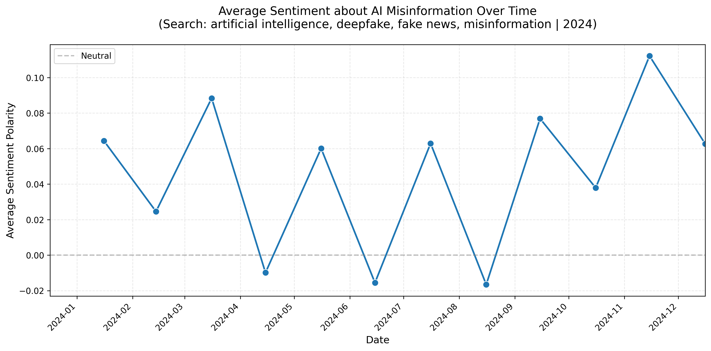

# AI Fake News Sentiment Analysis

A sentiment analysis and ranking pipeline for AI-related fake news articles.

## Project Overview

This project collects AI-related news articles, performs sentiment analysis, and ranks them by relevance. It uses the New York Times Article Search API to gather articles and analyzes sentiment using either TextBlob (fast, rule-based) or RoBERTa (slower, more accurate).

## Project Structure

```
ai-fake-news-sentiment/
├── data/
│   ├── raw/          # Raw news data
│   ├── processed/    # Processed data
│   └── figures/      # Generated visualizations
├── src/
│   ├── collector.py  # News collector
│   ├── preprocess.py # Text preprocessing
│   ├── sentiment.py  # Sentiment analysis
│   ├── ranking.py    # Ranking algorithms (TF-IDF, BM25)
│   ├── evaluate.py   # Evaluation metrics
│   └── visualize.py  # Visualization
├── main.py           # Main execution script
└── requirements.txt
```

## Installation

1. Clone the repository:
```bash
git clone https://github.com/dongyeon522/ai-fake-news-sentiment
cd ai-fake-news-sentiment
```

2. Create and activate virtual environment:
```bash
python -m venv venv
source venv/bin/activate  # Windows: venv\Scripts\activate
```

3. Install dependencies:
```bash
pip install -r requirements.txt
```

**Note**: For RoBERTa sentiment analysis, additional packages (`transformers` and `torch`) are included in `requirements.txt`. These will be installed automatically, but note that they require significant disk space (~1GB+).

4. Set up environment variables:
```bash
cp .env.example .env
# Set NYT_API_KEY in .env file
```

## Usage

### Run the complete pipeline:

```bash
python main.py
```

Or use the convenience script:

```bash
./run.sh
```

This will:
1. Collect news articles from NYT API (monthly search mode)
2. Preprocess the data
3. **Prompt you to select sentiment analysis method** (TextBlob or RoBERTa)
4. Perform sentiment analysis
5. Evaluate results
6. Run ranking experiments
7. Generate visualizations

**Note**: When running, you'll be prompted to choose between:
- **TextBlob**: Faster, rule-based sentiment analysis
- **RoBERTa**: Slower but more accurate deep learning-based sentiment analysis

## Features

- **News Collection**: Collect news articles via New York Times Article Search API
- **Monthly Search**: Automatically splits queries by month for better temporal coverage
- **Preprocessing**: URL removal, text normalization
- **Sentiment Analysis**: 
  - **TextBlob**: Fast, rule-based sentiment analysis
  - **RoBERTa**: Deep learning-based sentiment analysis (more accurate)
- **Ranking**: TF-IDF and BM25 algorithms for relevance ranking
- **Evaluation**: Comprehensive sentiment distribution statistics with configurable thresholds
- **Visualization**: Time-series visualization of sentiment changes
- **Rate Limiting**: Automatic rate limit management and retry logic (optimized wait times)
- **Progress Tracking**: Real-time progress display during data collection

## Configuration

### Environment Variables

`.env` file should contain:

```
NYT_API_KEY=your_api_key_here
```

Get your free API key from [NYT Developer Portal](https://developer.nytimes.com/).

### Settings

In `main.py`, you can adjust:

- `MAX_PAGES`: Maximum pages per query (default: 3 for test mode, use 20-50 for production)
- `page_size_per_query`: Articles per search (default: 10)
- `monthly`: Whether to search monthly (default: True)
- `TEST_MODE`: Set to `False` for full year search (default: `False`)

### Sentiment Analysis Configuration

**Method Selection**: When running `main.py`, you'll be prompted to choose between TextBlob and RoBERTa.

**Threshold Configuration**: In `src/evaluate.py`, the `evaluate_sentiment_distribution()` function accepts threshold parameters:

```python
from src.evaluate import evaluate_sentiment_distribution

# Default thresholds (pos_th=0.1, neg_th=-0.1)
stats = evaluate_sentiment_distribution(df)

# Custom thresholds
stats = evaluate_sentiment_distribution(df, pos_th=0.2, neg_th=-0.2)
```

## Output Files

Files are automatically saved with timestamps:
- `data/raw/articles_YYYYMMDD_NNN.csv` - Raw article data from NYT API
- `data/processed/corpus_with_sentiment_YYYYMMDD_NNN.csv` - Processed data with sentiment scores
- `data/figures/sentiment_over_time_YYYYMMDD_NNN.png` - Time-series visualization

## Example Output

After running the pipeline, you'll see sentiment statistics like:

```
[4/6] Evaluating sentiment results...

Sentiment distribution statistics:
  Mean sentiment: 0.045
  Standard deviation: 0.227
  Positive ratio: 32.39%
  Negative ratio: 16.52%
  Neutral ratio: 51.09%
```

### Generated Files

The pipeline generates three output files:

1. **Raw Data CSV**: `data/raw/articles_YYYYMMDD_NNN.csv`
   - Contains raw article data collected from NYT API
   - Columns: query, source, author, title, description, content, url, published_at

2. **Processed Data CSV**: `data/processed/corpus_with_sentiment_YYYYMMDD_NNN.csv`
   - Contains preprocessed text and sentiment scores
   - Columns: query, source, author, title, description, content, url, published_at, text, sentiment

3. **Visualization PNG**: `data/figures/sentiment_over_time_YYYYMMDD_NNN.png`
   - Time-series plot showing sentiment trends over time
   - Example: `sentiment_over_time_20251205_002.png`
   
   

## Performance Notes

- **TextBlob**: Fast execution, suitable for large datasets
- **RoBERTa**: Slower but more accurate. First run downloads ~500MB model (cached for subsequent runs)
- **Rate Limiting**: Optimized retry logic with 15-second default wait time (reduced from 60 seconds)
- **Progress Display**: Real-time progress updates during data collection

## License
